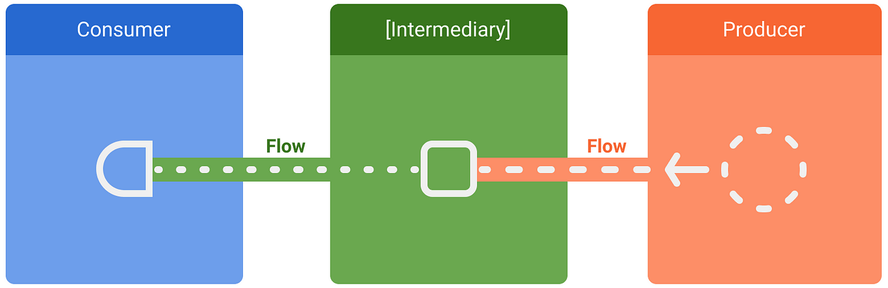

# Getting Started

## Installation

To add Stream to your project, include the following dependency in your build.gradle.kts file:

``` kotlin
dependencies {
    implementation("com.example:kotlinstream:1.0.0")
}

```

<!--  -->

## Basic Usage

Here's a simple example of how to perform a GET request using Stream:

```kotlin
import com.example.kotlinstream.HttpClient
import kotlinx.coroutines.runBlocking

fun main() = runBlocking {
    val client = HttpClient()
    val response = client.get("https://api.example.com/data")
    println(response)
}
```